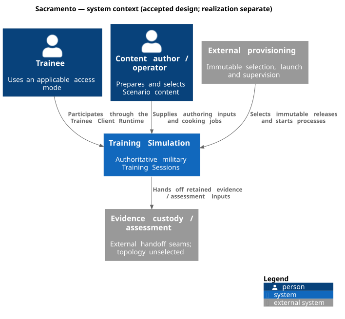
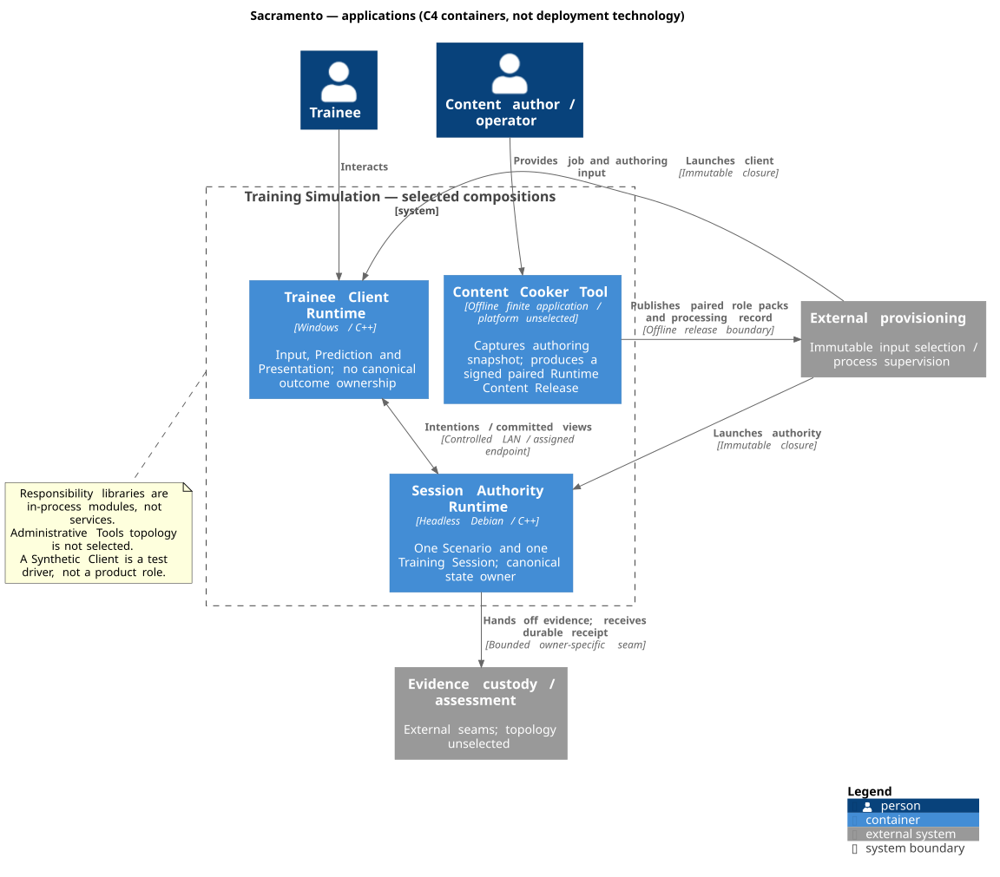
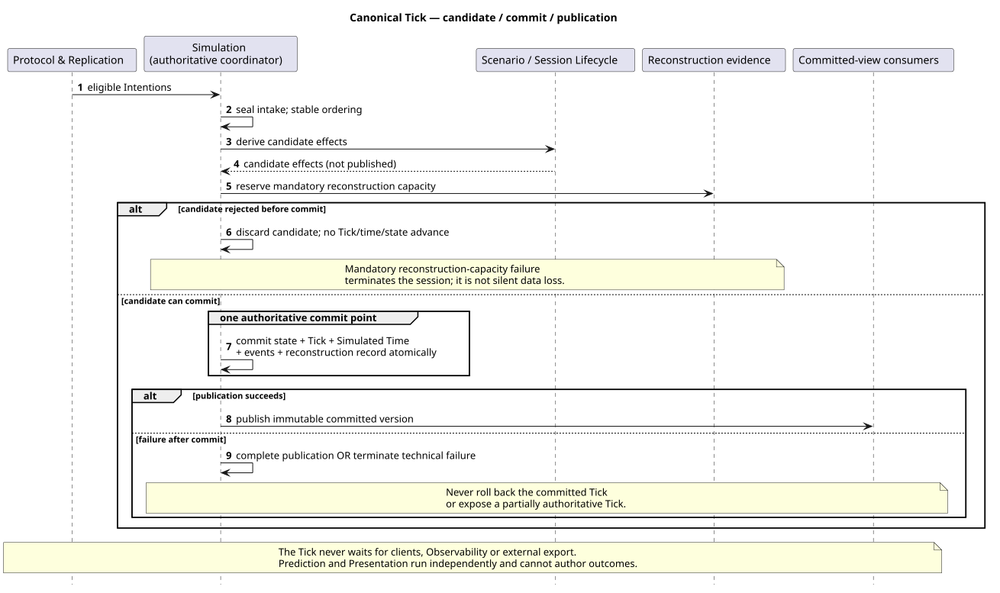
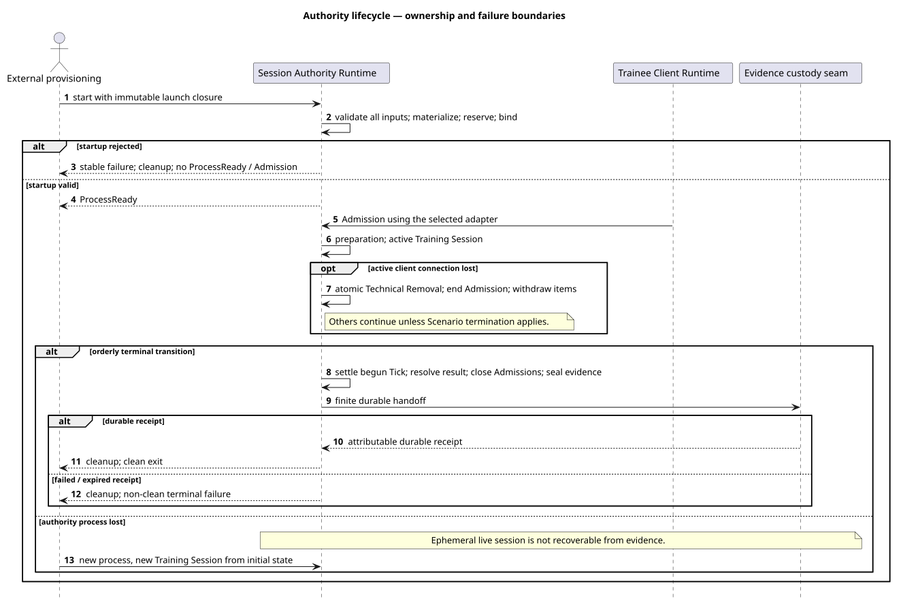
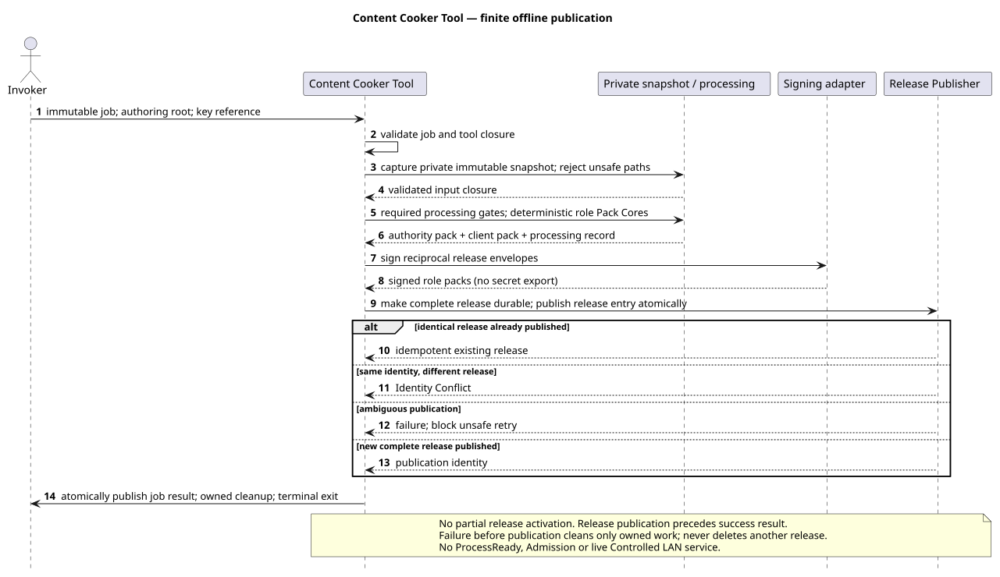

# Software Architecture Description

Status: Accepted architecture; product realization and evidence remain as recorded
in the [claim register](../project/training-simulation-architecture-claim-traces.csv).
Owner: Project owner. This is the architecture entry point, not an implementation
report. Read the overview first; open a contract only for the behavior you change.
The [documentation policy](../project/documentation-policy.md) governs maintenance.

## 1. Goals and quality priorities

Sacramento is a military Training Simulation with authoritative, reproducible
outcomes and several Trainee access modes. The main architectural priorities are
canonical-state consistency, bounded response time, credible training behavior,
and a maintainable product for a very small team. Exact obligations remain in the
[requirements](../requirements/README.md); diagrams explain their allocation, not
new requirements. Production security and Autonomous Participants are future
baselines, not implied by the Development Baseline.

## 2. Constraints

The Trainee Client Runtime targets Windows; the Session Authority Runtime targets
Debian and is headless. Both use the governed C++ toolchain and private platform
adapters. The finite, offline Content Cooker Tool has no selected native target
platform yet. Native-target evidence is required for applicable executable
closure; a cross-build alone does not establish it. See the
[engineering baseline](../standards/cpp-engineering.md) when changing builds.

## 3. Context and scope

Trainees interact with the Training Simulation. External provisioning selects
immutable inputs and starts or supervises processes. Evidence custody and
assessment are external seams, not selected services or databases. Administrative
Tools belong to the wider product scope but their topology is not selected here.
See [scope and terminology](../../CONTEXT.md).

## 4. Solution strategy

One Session Authority owns canonical outcomes. Clients send Intentions and consume
committed state; Prediction and Presentation cannot author those outcomes.
Deep modules follow responsibility, with narrow Sacramento interfaces and private
vendor adapters. Immutable content is cooked before runtime startup. Bounded work,
explicit ownership and failure scope protect the Canonical Tick from clients,
telemetry and external services. [ADRs](../adr/README.md) record why these choices
were made; detailed contracts remain authoritative for their exact semantics.

## 5. Building blocks

These C4 containers are applications, not Docker containers. Simulation Engine and
the responsibility libraries are not separate services. The Content Cooker Tool
is a finite invocation, not a third live runtime.

| Composition | Responsibilities to inspect when changing it |
| --- | --- |
| Session Authority Runtime | Simulation, Scenario, Session Lifecycle, AUTH & Admission, Runtime Package, Content Admission, Protocol & Replication, Observability |
| Trainee Client Runtime | AUTH & Admission, Runtime Package, Content Admission, Protocol & Replication, Prediction, Presentation, Input & Interaction, Observability |
| Content Cooker Tool | Runtime Package plus private importing, signing, result and Release Publisher adapters |

The [module contract](0004-canonical-responsibility.md) owns the complete dependency
rules. Dependencies are acyclic and point toward the responsibility owner; no
generic Common module or vendor-type public API is introduced. Component diagrams
are added only when a specific seam cannot be understood from this allocation.

## 6. Runtime view

The authority seals and orders eligible Intentions, derives a candidate, then
commits state, Tick, Simulated Time, events and reconstruction together before
publishing immutable views. A pre-commit rejection advances none of these. A
post-commit failure cannot roll back a committed Tick: publication completes or
the session terminates as a technical failure. See the
[tick contract](0005-fixed-step-authoritative-runtime.md) and
[ownership/failure contract](0006-runtime-ownership-and-failure.md).

One authority process owns one Scenario and one Training Session. Startup validates
the immutable dependency closure and reserves capacity before `ProcessReady` or
Admission. Client loss during an active session causes irreversible Technical
Removal, not simulated injury. Other Trainees continue unless the Scenario's
termination rules apply. Authority loss destroys the ephemeral live session; a
replacement starts a new session and never restores it from evidence.

Cooking captures a private immutable authoring snapshot, applies the required
processing gates, builds the paired role packs and processing record, signs and
durably publishes the complete release, then publishes the job result and exits.
An identical retry is idempotent; an incompatible existing release identity is an
Identity Conflict. See the [cooker contract](0013-offline-content-cooker-tool.md).

The [architecture acceptance examples](acceptance-scenarios.md) preserve all six
architecture-dominating success/failure cases plus cooking, including external
handoff exhaustion and failed terminal receipts. They are **not run** product
acceptance examples, not passing tests.

## 7. Deployment view

The two live runtimes communicate over the Controlled LAN using explicitly
assigned endpoints. There is no discovery, fallback endpoint or runtime content
download. External provisioning selects complete Application Releases, role packs,
trust references and immutable launch configuration. Updates and rollback affect
later processes, never a live release. The
[deployment contract](0009-runtime-deployment-contracts.md) defines compatibility,
readiness and shutdown. A Synthetic Client is a test driver, not a product role.

## 8. Cross-cutting contracts

| Change concern | Canonical contract |
| --- | --- |
| Ownership, fences, waits, backpressure and contained failure | [Concurrency](0006-runtime-ownership-and-failure.md) |
| Paired releases, role trust, activation and retention | [Content](0007-runtime-content-releases.md) |
| Exact binary format, signatures, graph validation and materialization | [Role packs](0012-runtime-resource-and-role-pack-architecture.md) |
| Session Evidence Set, durable receipt, cleanup and ephemeral state | [Evidence lifetime](0008-evidence-and-ephemeral-state.md) |
| Immutable configuration, stable outcomes, adapter contracts and evidence hooks | [Cross-cutting](0010-cross-cutting-architecture-and-verification.md) |
| Owner/lifetime/resource accounting, capacity and GPU fences | [Memory](0011-memory-accounting-and-allocation.md) |

Operational Clock, Simulated Time, presentation time and Trusted Identity Time are
distinct. Core Observability is bounded and cannot mutate canonical outcomes or
assign verification Pass. Diagnostic profiling does not replace it. Exact
retention, trust and lifetime obligations remain in their owning contracts.

## 9. Decisions

The [ADR index](../adr/README.md) is the decision history. ADR-0003 through ADR-0013
select the product architecture; ADR-0014 replaces the document-control policy,
not the product design. Proposed Software Design Documents remain
[candidate design](../design/training-simulation-software-design-baseline.md).
Decision, applicability, realization and evidence are independent states.

## 10. Quality and acceptance

Use one requirement and an observable acceptance example to start each increment.
Develop deterministic behavior with red–green–refactor at public seams, then add
applicable integration and native-target checks. Test outcomes must come from the
requirement, reference model or approved data, not a copy of the implementation.
Use measurement for performance and qualified evaluation where military validity
cannot be established objectively. The [acceptance workflow](../requirements/training-simulation-verification-plan.md)
and searchable catalogue replace mandatory full-plan reading.

## 11. Risks and open work

Dependency qualification, reference workloads, unpopulated profile/type
catalogues, product implementation and native evidence remain open. Cooker platform,
production security, platform operations, Autonomous Participants and After-Action
Review retain their explicit future boundaries. An accepted diagram resolves none
of these. [Applicability](../requirements/training-simulation-baseline-applicability.md)
records scope; [GitHub issues](https://github.com/sergioffpc/sacramento/issues)
record executable work. Conservative impact analysis reruns affected or uncertain
evidence; missing references never prove a result unaffected.

## 12. Glossary and maintenance

Use [CONTEXT](../../CONTEXT.md), the
[technical glossary](../glossary/technical.md) and
[governance glossary](../glossary/governance.md) for canonical terms.
Edit the relevant `.puml` source and run `python3 scripts/render-diagrams.py`;
the adjacent SVGs are generated previews. Run `python3 scripts/documentation.py check`
after a documentation change. Review the changed meaning and directly affected
contracts, not every document in the repository.
